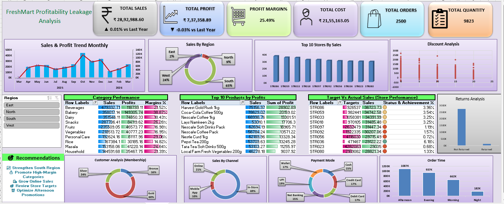

# 🛒 FreshMart – Retail Sales Dashboard

> **Interactive Retail Sales Analysis Dashboard using Microsoft Excel**

## 🎯 Objective

To analyze **FreshMart retail sales data** and create an interactive dashboard that provides clear insights into **Sales, Profit, Quantity, Orders, Regions, Categories, Payment Methods, and Store Performance**.

## 🛠️ Tools Used

* Microsoft Excel
* Data Cleaning
* Pivot Tables
* Pivot Charts
* Data Visualization
* Dashboard Design

## 📌 Key KPIs

| Metric            |         Value |
| ----------------- | ------------: |
| 💰 Total Sales    | ₹28,48,016.06 |
| 📈 Total Profit   |  ₹7,31,147.62 |
| 📦 Total Quantity |         8,762 |
| 🧾 Total Orders   |         2,451 |

## 📊 Dashboard Analysis

* 🌍 **Region-wise Sales**
* 🛍️ **Category-wise Sales**
* 💳 **Payment Method Analysis**
* 🏪 **Top 10 Stores**
* 🎛️ **Interactive Filters**

## 💡 Key Insights

* Total sales exceeded **₹28.48 Lakhs**.
* Total profit reached approximately **₹7.31 Lakhs**.
* **8,762** units were sold across **2,451** orders.
* Regional and category-wise performance can be compared easily.
* Payment method and top-store performance provide additional business insights.

## ✅ Project Status

**Completed | FreshMart Excel Data Analytics Project**

---

### 👨‍💻 Skills Demonstrated

**Excel • Data Cleaning • Data Analysis • Pivot Tables • Data Visualization • Dashboard Development**
