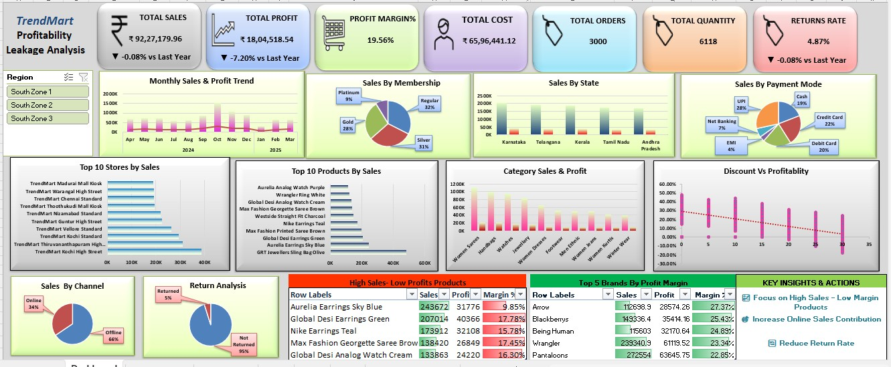

# 🛍️ TrendKart – Sales Dashboard

> **Interactive Sales Analysis Dashboard using Microsoft Excel**

## 🎯 Objective

To analyze **TrendKart sales data** and create an interactive dashboard that provides clear insights into **Sales, Profit, Quantity, Top Stores, Top Selling Products, and Monthly Sales Trends**.

## 🛠️ Tools Used

* Microsoft Excel
* Data Cleaning
* Pivot Tables
* Pivot Charts
* Data Visualization
* Dashboard Design

## 📌 Key KPIs

| Metric            |         Value |
| ----------------- | ------------: |
| 📦 Total Quantity |         6,118 |
| 💰 Sales Amount   | ₹92,27,179.96 |
| 📈 Profit Amount  | ₹18,04,518.54 |

## 📊 Dashboard Analysis

* 🏪 **Top 10 Stores**
* 🛍️ **Top 10 Selling Products**
* 📅 **Monthly Sales Trend**
* 🎛️ **Region Filters**
* 🏷️ **Category Filters**
* 📆 **Invoice Date Filters**

## 💡 Key Insights

* Total sales reached approximately **₹92.27 Lakhs**.
* Total profit generated is approximately **₹18.05 Lakhs**.
* A total of **6,118 units** were sold.
* Top-performing stores and products can be identified easily.
* Monthly sales trends help understand business performance over time.

## ✅ Project Status

**Completed | TrendKart Excel Data Analytics Project**

---

### 👨‍💻 Skills Demonstrated

**Excel • Data Cleaning • Data Analysis • Pivot Tables • Data Visualization • Dashboard Development**
