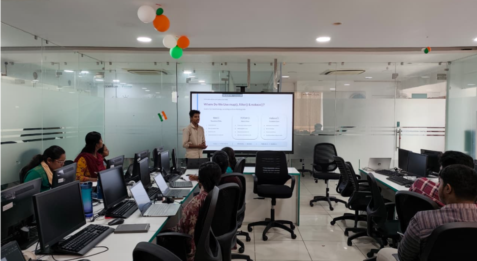

# Python map(), filter() & reduce()

## Peer Learning Presentation

This repository contains my Peer Learning presentation on Python's
`map()`, `filter()`, and `reduce()` functions.

These functions are useful for **transforming, selecting, and combining data**.

---

## 📸 Peer Learning Session



---

## 📚 Topics Covered

- Python `map()` function
- Python `filter()` function
- Python `reduce()` function
- Syntax and working
- Real-life applications
- Important rules
- Function comparison
- Practical examples

---


1. map()

`map()` is used to apply the same function to every item in an
iterable and produce transformed results.

## Syntax

```python
map(function, iterable)


# 2. filter()

`filter()` is used to select only the elements that satisfy a
particular condition.

## Syntax

```python
filter(function, iterable)


# 3. reduce()
'reduce()' is used to combine multiple values step by step to produce
one final result.
## Syntax

'''python
reduce(function, iterable)
